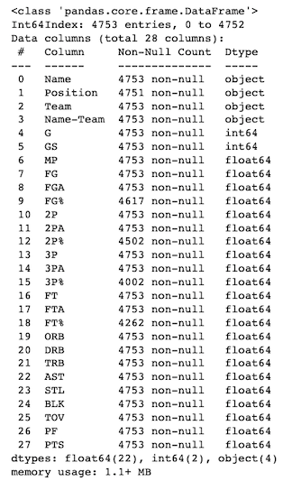
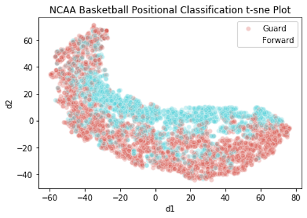
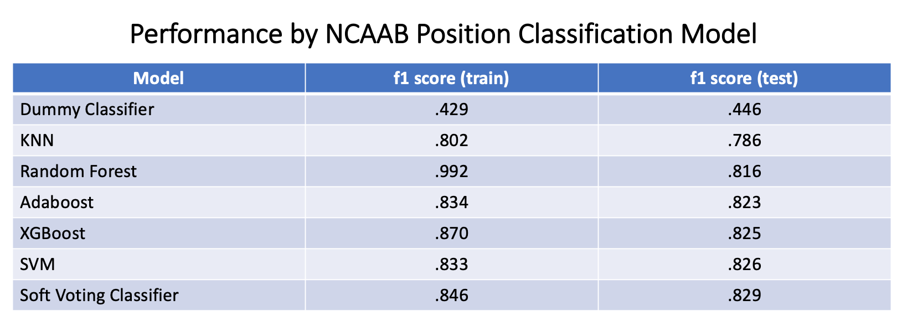
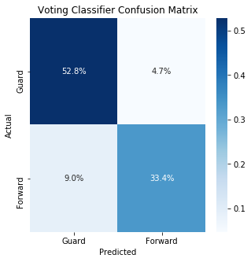
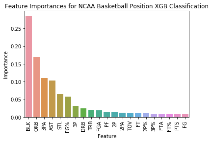

# NCAA Basketball Position Classification Modeling

## Introduction
I set out to build a model that could classify an NCAA Basketball player's position based on their game statistics and then to determine the feature importances in classifying players.  I scraped the college basketball stats and position data from the Sports Reference website and read it into Pandas, resulting in 4,753 datapoints across 25 feaures after scrubbing.  I modeled the data into 2 classes, Guards and Forwards, using 6 classification models.  The top performing model was a Weighted Soft Voting Classifier that included XGBoost, KNN and Adaboost. This model outperformed the baseline Stratified Dummy Classifier model with a test f1 score of .829 vs. .446. Important features in classifying NCAA Basketball players' positions were Blocks (.28), Offensive Rebounds (.17) and 3 Point Attemps (.11).

## Obtain Data
I used Selenium to scrape player game statistics and position data from the Sports Reference website for all NCAA players from the 2018–19 season, the most recent full college basketball year, and loaded them into a Pandas df. The raw scraped data included 28 features across 4,753 datapoints.

## Scrub Data

I first dropped the df’s descriptive features not useful for modeling or EDA. I next filled in the two missing position values by looking them up in alternative sources. I also filled in missing shooting % values with 0 as these players had not attempted any of that shot type.

A countplot of the raw class distribution revealed strong imbalance across the 4 classes with counts of: G: 2,767, F: 1,750, C: 235 and D: 1. I first merged the single misentered class D datapoint into the correct class C. Basketball Reference split the 5 basketball positions into just 3 classes: G (PG and SG), F (SF and PF) and C (C). As one of 5 basketball positions Centers should receive 20% of playing time and make up 20% of players, yet the C class only represented 5% of all datapoints. Based on this, it appeared that a lot of NCAA coaches were listing players putting in significant minutes at Center as Power Forwards. A t-SNE plot confirmed that Centers were generally indistinguishable from Forwards, so I merged the C class into the F class.  The final scrubbed dataset included 25 features across 4,753 datapoints. 

## Explore Data

After data scrubbing, class imbalance had been significantly reduced, with the Guard class, 0, making up 58% of datapoints and the Forward class, 1, making up 42% of datapoints. I decided not to re-balance the dataset as it was already close to being class balanced, I was planning to use f1 score as the principal evaluation metric and I did not have time to build multiple sets of models in order to determine the optimally performing class balance.

In the process of scrubbing the data, I noticed that there were a lot of datapoints that had not attempted any shots. I was worried that there would be many players in the model that had relatively little playing time and would not have enough feature performance data to make a meaningful class prediction. In order to better understand the extent of this issues, I graphed the distributions of Number of Games Played and Minutes Per Game by player. Around 9% of players had played in fewer than 5 games and 18% of players had played fewer than 5 minutes per game. While these players would likely impact model quality, they represented a small enough minority of all datapoints that strong performing models would still be possible.

The final EDA I performed was to create a t-SNE plot of all player datapoints by class in order to contextualize subsequent model performance. The t-SNE plot demonstrated significant modeling potential with an area of near-pure Forward class datapoints at the top-right, a smaller area of near pure Guard Class datapoints at the bottom right and a larger area of majority Guard class datapoints to the bottom and left.

## Model Data

I built 6 classification models, all of which greatly outperformed the baseline Stratified Dummy Classifier in f1 score. The top performing model was a Weighted Soft Voting Classifier that included XGBoost, KNN and Adaboost. This model outperformed the baseline Stratified Dummy Classifier model with a test f1 score of .829 vs. .446. The top performing single model was SVM with a test f1 score of .826.

The Voting Classifier confusion matrix revealed that the top performing model slightly overpredicted datapoints as members of the majority Guard class with 61.8% of predicted datapoints as G versus 57.5% of actuals. This yielded a higher specificity score for Guards of .918 versus the sensitivity for Forwards of .788. While the model did perform better for Guards than Forwards, the use of f1 score as the principal evaluation metric meant that both classes performed realtively strongly.

## Analyze Results

In order to get a better sense of the relative importances of different features in classifying players, I pulled feature importances for XGBoost. This was the top performing model with available feature importances and only slightly underperformed the Voting Classifier. Unsurprisingly, features such as FG and PTS commonly associated with players of all types had low feature importances. The top two performing feature importances, BLK (.28) and ORB (.17), are both basketball activities mostly associated with larger Forward class players. The next three most important features, 3PA (.110), AST (.110) and STL (.064) are all principally associated with smaller Guard class players. The stratification of responsibilities among basketball players of different sizes results in statistical differences between Guards and Forwards, which explains why I was able to develop strong performing models to classify players by position.

## Next steps
With more time, I would like to try resampling techniques to see if they improve model performance.

# Github Files
[Modeling.ipynb](https://github.com/blantj/ncaab_position_classification/blob/main/Modeling.ipynb) :  NCAAB Positional Classification modeling

# Sources
Sports Reference: https://www.sports-reference.com/cbb/
